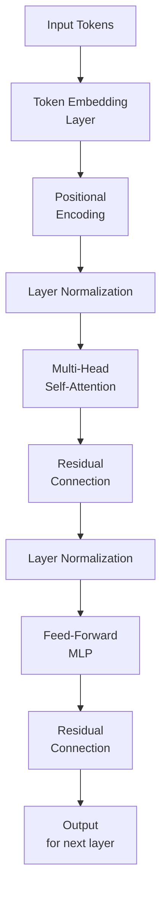

Large language models (LLMs) like GPT, LLaMA, and Gemini feel almost “intelligent” because their internal architecture is designed to capture rich patterns in text.  This article explains how they work from tokens to full responses and includes diagrams to help you visualize the key ideas.

***
## 1. What an LLM Actually Does
An LLM is, at heart, a **next‑token predictor**: given your prompt, it estimates the most likely next token, then repeats this step to build a full response.  It learns these patterns by training on vast amounts of text, so its outputs resemble human‑like language even though it has no conscious understanding.


```mermaid
graph LR
    A[Input Sequence] --> B(Tokenization)
    B --> C[Token IDs]
    C --> D[LLM Model]
    D --> E[Next‑Token<br/>Probability Distribution]
    E --> F{Sampling<br/>(e.g., top‑k / nucleus)}
    F --> G[Selected Token]
    G --> H[Append to Output]
    H --> I{End of<br/>sequence?}
    I -->|No| D
    I -->|Yes| J[Final Output Text]
``` 
*Figure: How an LLM takes a sequence, predicts probabilities for the next token, and generates the next word or subword.*

## 2. Turning Text into Numbers
Before math can happen, text is converted into numbers:

- **Tokenization**: The input is split into **tokens** (words, word‑parts, or punctuation).
- **Embedding**: Each token is mapped to a **vector** by an embedding layer, turning discrete symbols into continuous numerical representations.

These vectors become the input to the model’s neural‑network layers.

## 3. The Transformer Architecture
Most modern LLMs use a **decoder‑only Transformer** architecture, in which:

- Each layer has **multi‑head self‑attention** and **feed‑forward MLP** blocks.
- **Positional encodings** or **RoPE**‑style embeddings are added so the model knows token order.

The architecture is “decoder‑only” because it only needs to read the prefix and generate the continuation, not encode a separate source sequence.


*Figure: A decoder‑only Transformer block with embedding, normalization, self‑attention, and feed‑forward layers.*


## 4. Self‑Attention in Action
Self‑attention lets every token “attend” to all previous tokens in the sequence, weighting how much each one matters for the current prediction.  This is why LLMs can handle long‑range dependencies and context: every word in the prompt can influence later tokens.

```mermaid
graph TD
    A[Input Representation] --> B[Layer Norm]
    B --> C[Multi‑Head<br/>Self‑Attention]
    C --> D[Residual<br/>Connection]
    D --> E[Layer Norm]
    E --> F[Feed‑Forward<br/>Network (MLP)]
    F --> G[Residual<br/>Connection]
    G --> H[Output to<br/>Next Block]
```
*Figure: Key components of a transformer decoder block, including multi‑head self‑attention and feed‑forward modules.*


## 5. Training: From Raw Text to Language Skill
LLMs are usually trained in several stages:

1. **Pre‑training (self‑supervised)**: The model learns general language statistics by predicting masked or next tokens on huge corpora.
2. **Fine‑tuning (supervised)**: The model is adjusted on labeled examples (instruction–response pairs, QA, etc.) to follow tasks.
3. **Alignment (RLHF or DPO)**: Human‑rated responses are used to tune the model so outputs are helpful, honest, and safe.

These stages can be thought of as a pipeline that gradually shapes raw language capability into a usable assistant.

```mermaid
graph LR
    A[Massive Text Corpus] --> B[Pre‑training<br/>(Self‑supervised)]
    B --> C[Pre‑trained<br/>Base Model]
    C --> D[Supervised Fine‑Tuning<br/>(SFT)]
    D --> E[Fine‑tuned<br/>Task Model]
    E --> F[Reinforcement Learning / Alignment<br/>(RLHF or DPO)]
    F --> G[Aligned<br/>Assistance Model]
```
  
*Figure: Three stages of LLM training: pre‑training, supervised fine‑tuning, and reinforcement learning / alignment.*

## 6. How Inference Works: From Prompt to Output
During inference:

- Your prompt is tokenized and embedded.
- The embeddings pass through the transformer layers, building contextual representations.
- The model outputs a **probability distribution** over possible next tokens, and a sampling strategy (e.g., top‑k, nucleus sampling) picks the next token.

This repeats until a stop‑token is generated or the context window is full.

```mermaid
graph LR
    A[Input Sequence] --> B[LLM Model]
    B --> C[Probability Distribution<br/>over Tokens]
    C --> D[Token A: p=0.45]
    C --> E[Token B: p=0.20]
    C --> F[Token C: p=0.15]
    C --> G[...: p=...]
    D --> H{Sampling<br/>(e.g., top‑k / nucleus)}
    E --> H
    F --> H
    G --> H
    H --> I[Selected Token]
    H --> I[Selected Token]
    I --> J[Append to Output]
```
*Figure: Visualization of next‑token probabilities, showing how the model chooses among candidate tokens.*

## 7. Why They “Feel” Intelligent
LLMs are effectively **pattern‑matching machines**: their internal parameters encode statistical correlations between words and contexts learned from training data.  When the data is broad and diverse, these patterns can approximate reasoning steps, summarization, and coding, even though the model has no symbolic world model.


## 8. Common Limitations
Important limitations to keep in mind:

- **No persistent memory**: The model only “remembers” what is in the current context window.
- **Hallucination**: It can invent false facts that sound plausible.
- **Context window limits**: There is a fixed maximum length (e.g., 8k, 32k, or 128k tokens) beyond which older text is dropped.

## 9. Putting It All Together
In summary, an LLM:

- Converts text into token vectors and embeddings.
- Processes these through a deep decoder‑only Transformer using self‑attention and MLPs.
- Learns from massive text corpora, then is fine‑tuned and aligned with human feedback.
- Generates responses by repeatedly predicting and sampling the next token.
