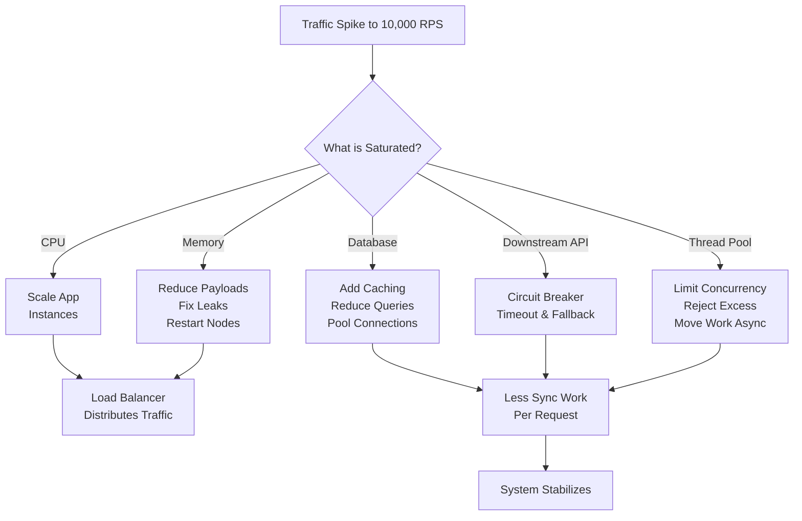
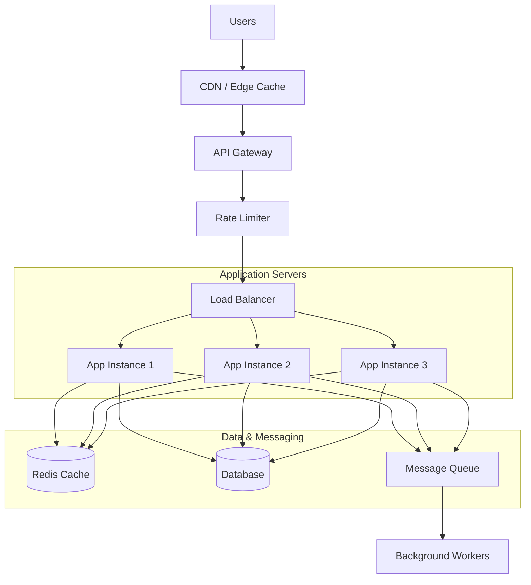
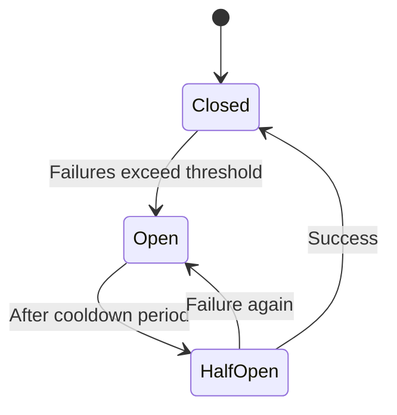

When an API starts receiving 10,000 requests per second and the server begins choking, the goal is not to “make it faster” in a vague sense. The goal is to **keep the system alive, protect critical users, and reduce load immediately** while you identify the real bottleneck.

This is exactly how I would handle it in an incident response scenario or a system design discussion.

---

## Summary of Instant Actions

If your API is overwhelmed by traffic, the fastest fix is to:
- **Rate limit** at the edge.
- **Cache** hot responses.
- **Scale** stateless services.
- **Offload** slow work to queues.
- **Protect** dependencies with circuit breakers.
- **Fail fast** instead of letting the server collapse.

---

## The Core Problem

A server choking under 10,000 RPS usually means one of these is happening:

- CPU is maxed out.
- Memory is exhausted.
- The database cannot keep up.
- Too many concurrent connections are open.
- One downstream service is slow or failing.
- Requests are doing too much work synchronously.

The important thing to understand is that **10,000 requests per second is not the real problem by itself**. The real problem is whether your architecture can absorb that traffic without turning every request into expensive work.

---

## First Response in 15 Minutes

When the incident is active, focus on survival first, optimization second.

### 1. Rate limit immediately

Put traffic controls at the edge or API gateway. This prevents one client, bot, or burst from taking down the system.

Typical actions:
- Per-IP rate limits.
- Per-user limits.
- Per-API-key quotas.
- Burst limits with token bucket or leaky bucket logic.

The purpose is not to block everyone. The purpose is to protect the service from overload and keep it usable for legitimate traffic.

### 2. Return 429s instead of dying

If traffic exceeds safe capacity, reject some requests early with a `429 Too Many Requests` response.

That is better than:
- letting all requests time out,
- exhausting threads,
- increasing latency for everyone,
- or crashing the server completely.

A controlled rejection is healthier than uncontrolled failure.

### 3. Cache aggressively

If the endpoint is read-heavy and responses repeat often, cache the hottest responses.

Good cache targets:
- product pages,
- profile lookups,
- public metadata,
- configuration endpoints,
- expensive computed reads.

You can cache at:
- CDN level,
- API gateway,
- application memory,
- Redis.

Even a small cache hit rate can remove a lot of load when traffic is high.

### 4. Scale stateless services

If the app layer is stateless, add more instances behind a load balancer.

This works best when:
- sessions are externalized,
- files are not stored locally,
- app servers can be replaced easily.

If the service is stateful and tightly coupled to local memory or local files, scaling becomes slower and more painful.

### 5. Push slow work async

Anything not required for the immediate response should move to a queue.

Examples:
- email sending,
- analytics,
- image processing,
- logging enrichment,
- webhooks,
- report generation.

Instead of making the user wait, accept the request quickly and process the heavy work in the background.

### 6. Protect downstream systems

Very often the API itself is not the main bottleneck. The database or another dependency is.

Use:
- connection pooling,
- query limits,
- circuit breakers,
- timeouts,
- retries with backoff,
- bulkheads.

If one dependency starts failing, the API should fail fast rather than dragging everything down.

---

## Decision Tree

---

## What Usually Breaks First

A high-RPS API often fails in one of these places.

### Database overload

This is the most common failure point.

Signs:
- slow queries,
- connection pool exhaustion,
- lock contention,
- high I/O,
- timeouts.

Fixes:
- cache read-heavy results,
- reduce query count,
- add indexes,
- remove N+1 patterns,
- split read and write traffic,
- use replicas for reads.

### Thread exhaustion

If each request blocks a worker thread, the server can run out of available concurrency even if CPU is not fully maxed.

Fixes:
- reduce blocking calls,
- use async I/O where appropriate,
- cap request concurrency,
- move expensive tasks to queues.

### Dependency failure

One slow third-party service can cascade into your API.

Fixes:
- circuit breakers,
- timeouts,
- fallback responses,
- partial degradation.

### Memory pressure

Large payloads, buffering, leaks, and excessive allocations can cause memory churn and crashes.

Fixes:
- stream data instead of buffering it,
- reduce response size,
- cap request body size,
- recycle bad instances.

---

## Recommended Emergency Architecture

This is the shape of a resilient system:
- traffic is filtered early,
- hot data is cached,
- app servers stay stateless,
- slow tasks are offloaded,
- the database is protected.

---

## Load Shedding Strategy

Load shedding means intentionally dropping some traffic so the system remains functional.

Good candidates to shed:
- anonymous traffic,
- low-priority endpoints,
- expensive reports,
- bulk exports,
- noncritical analytics.

Prioritize:
- logged-in users over anonymous users,
- critical writes over optional reads,
- customer-facing endpoints over internal jobs.

This is a practical tradeoff. A system that serves 70% of traffic reliably is often better than one that tries to serve 100% and collapses.

---

## Caching Strategy

Caching is one of the fastest ways to reduce pressure.

### Cache layers
- CDN cache for public content.
- Gateway cache for repeated API reads.
- Application cache for expensive computations.
- Redis for shared distributed caching.

### What to cache
- stable GET requests,
- reference data,
- computed summaries,
- user profile fragments,
- feature flags.

### What not to cache blindly
- highly personalized responses,
- frequently changing data without invalidation,
- sensitive data without strict controls.

The key is to cache what is expensive and reused.

---

## Circuit Breaker Strategy

A circuit breaker stops repeated calls to a failing dependency.

It helps when:
- the downstream service is timing out,
- retries are making the problem worse,
- one dependency is consuming all request threads.

Instead of waiting on every doomed call, the API returns quickly and protects itself.

This pattern is especially useful when a third-party service is unstable.

---

## Production-Ready Action Plan

To survive a traffic spike:
1. **Stabilize**: Rate limit, shed load, and cache hot endpoints immediately.
2. **Scale**: Scale out stateless app instances to distribute the load.
3. **Protect DB**: Use connection pooling, optimize queries, and spin up read replicas.
4. **Decouple**: Move heavy, noncritical tasks to asynchronous queues.
5. **Resilience**: Implement circuit breakers and quick timeouts to keep downstream failures from taking down the core API.

This methodical prioritization is what keeps a high-traffic API running smoothly when load peaks.

---

## Common Mistakes

Here are the mistakes that make incidents worse:

- Adding retries everywhere without timeouts.
- Scaling the app without fixing the database bottleneck.
- Keeping expensive work in the request path.
- Letting requests queue indefinitely.
- Ignoring slow downstream dependencies.
- Treating every request as equally important.

A good production response is not about doing more work. It is about doing less unnecessary work faster.
