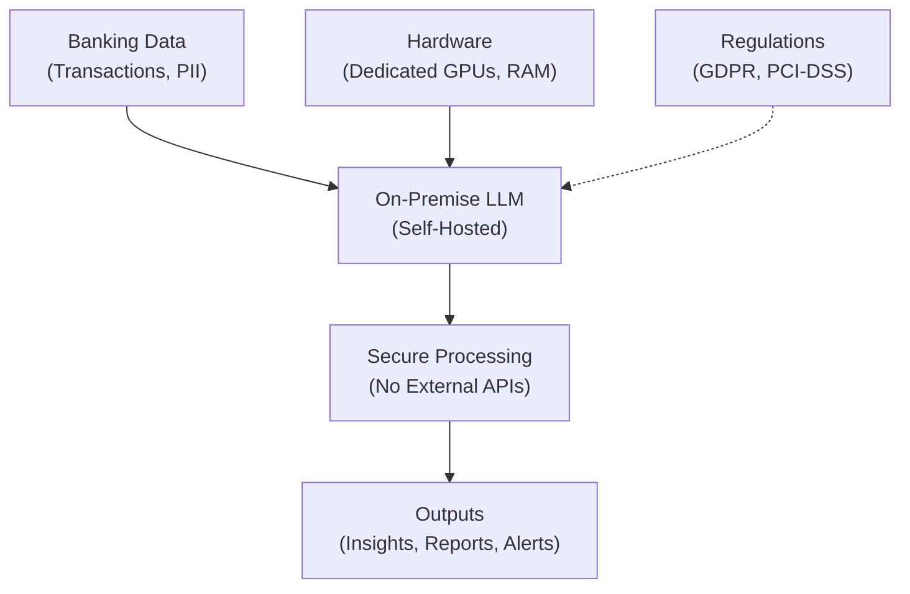
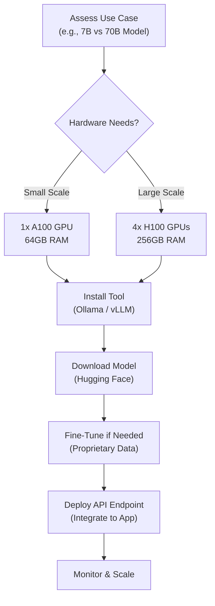
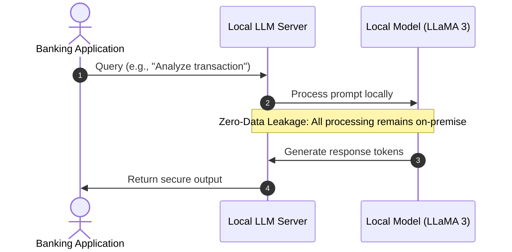

Banking systems demand ironclad data privacy, making hosted LLM APIs risky due to potential data exposure. Deploy self-hosted large language models (LLMs) on your infrastructure to process sensitive financial data locally, ensuring zero data sharing with third parties. [getdynamiq](https://www.getdynamiq.ai/post/generative-ai-and-llms-in-banking-examples-use-cases-limitations-and-solutions)

## Why Self-Host LLMs in Banking?

On-premise LLMs keep all customer data, transaction records, and compliance info within your secure environment, complying with GDPR, HIPAA, and banking regulations like PCI-DSS. This eliminates vendor lock-in, reduces latency for real-time fraud detection or risk analysis, and allows custom fine-tuning on proprietary datasets. Banks using self-hosted setups report 40% faster audit processes without external risks. [truefoundry](https://www.truefoundry.com/blog/on-prem-llms)

## Key Benefits of Private LLM Deployment

- **Data Sovereignty**: No data leaves your network, perfect for sensitive banking ops like credit scoring. [digitalapplied](https://www.digitalapplied.com/blog/local-llm-deployment-privacy-guide-2025)
- **Cost Efficiency**: Fixed hardware costs beat pay-per-token APIs after 100K+ daily tokens. [digitalapplied](https://www.digitalapplied.com/blog/local-llm-deployment-privacy-guide-2025)
- **Customization**: Fine-tune models (e.g., LLaMA 3) for finance-specific tasks like earnings summaries. [ai21](https://www.ai21.com/knowledge/llms-in-finance/)
- **Compliance Ready**: Full audit trails and air-gapped options for high-security workloads. [sombrainc](https://sombrainc.com/blog/llms-in-banking)

## Top Self-Hosted LLM Tools (2026)

Popular open-source tools enable easy deployment: Ollama for quick setup, llama.cpp for performance tweaks, vLLM for high-throughput serving. [daily](https://daily.dev/blog/running-llms-locally-ollama-llama-cpp-self-hosted-ai-developers)

| Tool | Best For | API Compatible | Setup Ease |
|------|----------|----------------|------------|
| Ollama | Beginners, quick deploy | OpenAI-style | One command  [daily](https://daily.dev/blog/running-llms-locally-ollama-llama-cpp-self-hosted-ai-developers) |
| llama.cpp | Advanced control, quantization | Native server | Compile from source  [daily](https://daily.dev/blog/running-llms-locally-ollama-llama-cpp-self-hosted-ai-developers) |
| vLLM | Production scale, multi-user | OpenAI | Docker-friendly  [spheron](https://www.spheron.network/blog/ollama-vs-vllm/) |
| LM Studio | GUI testing | OpenAI | Desktop app  [daily](https://daily.dev/blog/running-llms-locally-ollama-llama-cpp-self-hosted-ai-developers) |

Recommended models: LLaMA 3 (8B-70B), Mistral, Qwen 2.5 for finance tuning. [blog.premai](https://blog.premai.io/private-llm-deployment-a-practical-guide-for-enterprise-teams-2026/)

## Hardware for Banking LLM Deployment

For 7B models (e.g., fraud chatbots): 1x NVIDIA A100 40GB GPU, 64GB RAM, NVMe SSD. Scale to 70B for complex analysis: 4-8x H100 GPUs, 256GB+ RAM. Enterprise banking often uses GPU clusters in air-gapped data centers. [booleanbeyond](https://www.booleanbeyond.com/en/solutions/private-llm-deployment/on-premise-llm-infrastructure-requirements)

## Step-by-Step On-Premise Setup Guide

1. **Prepare Infrastructure**: Provision GPUs (e.g., NVIDIA DGX servers) with Ubuntu, install CUDA drivers. [booleanbeyond](https://www.booleanbeyond.com/en/solutions/private-llm-deployment/on-premise-llm-infrastructure-requirements)
2. **Choose Tool**: Run `curl -fsSL https://ollama.com/install.sh | sh` for Ollama. [blog.premai](https://blog.premai.io/self-hosted-llm-guide-setup-tools-cost-comparison-2026/)
3. **Pull Model**: `ollama pull llama3` – downloads quantized version locally. [daily](https://daily.dev/blog/running-llms-locally-ollama-llama-cpp-self-hosted-ai-developers)
4. **Fine-Tune Securely**: Use internal datasets for RAG or LoRA adapters, keeping all on-prem. [axxiome](https://www.axxiome.com/news/2025/should-financial-institutions-self-host-large-language-models)
5. **Expose API**: `ollama serve` creates OpenAI-compatible endpoint at localhost:11434. [daily](https://daily.dev/blog/running-llms-locally-ollama-llama-cpp-self-hosted-ai-developers)
6. **Integrate**: Update banking apps to point to your endpoint – no data leaves. [aiintime](https://www.aiintime.com/post/on-premise-llm-deployment)
7. **Secure & Monitor**: Add firewalls, RBAC, logging for compliance. [protecto](https://www.protecto.ai/industry/sovereign-ai-for-banks/)

This setup powers tasks like compliance reporting or customer query analysis without risks. [aiveda](https://aiveda.io/blog/private-llm-use-cases-for-regulated-industries)

## Banking Use Cases & ROI

Self-hosted LLMs excel in summarizing filings, anti-fraud alerts, and personalized advice – all privately. European banks cut manual reviews by 40% via fine-tuned on-prem models. Start small with chatbots, scale to full automation. [llm](https://llm.co/industries/finance-banking)
